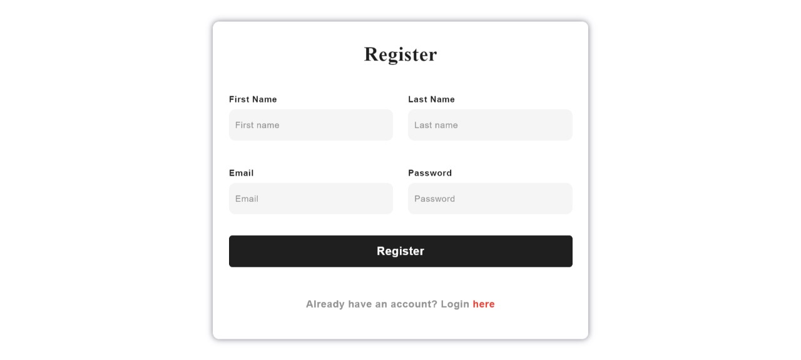
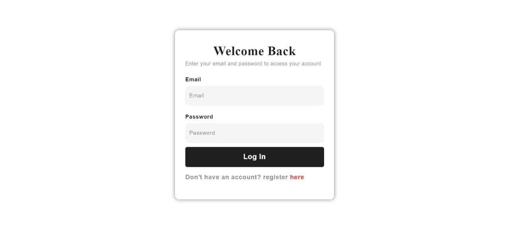
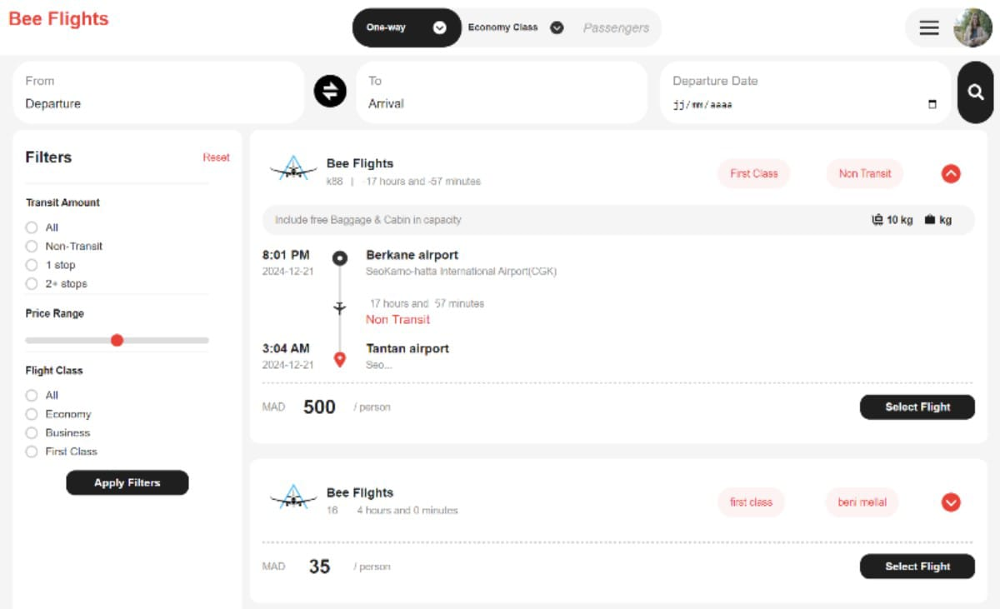
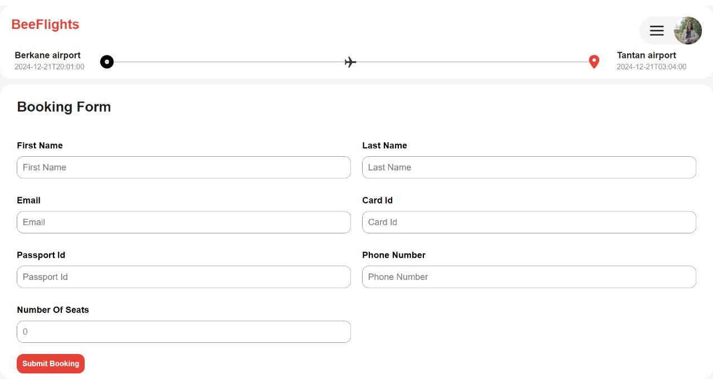
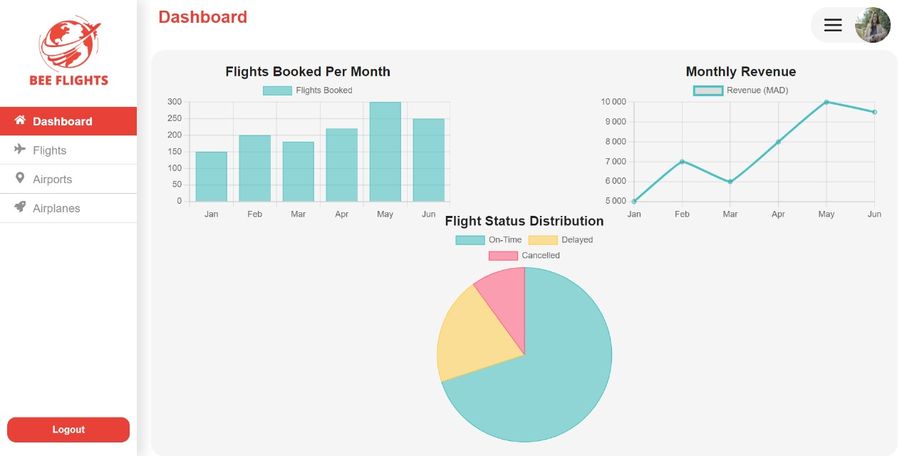
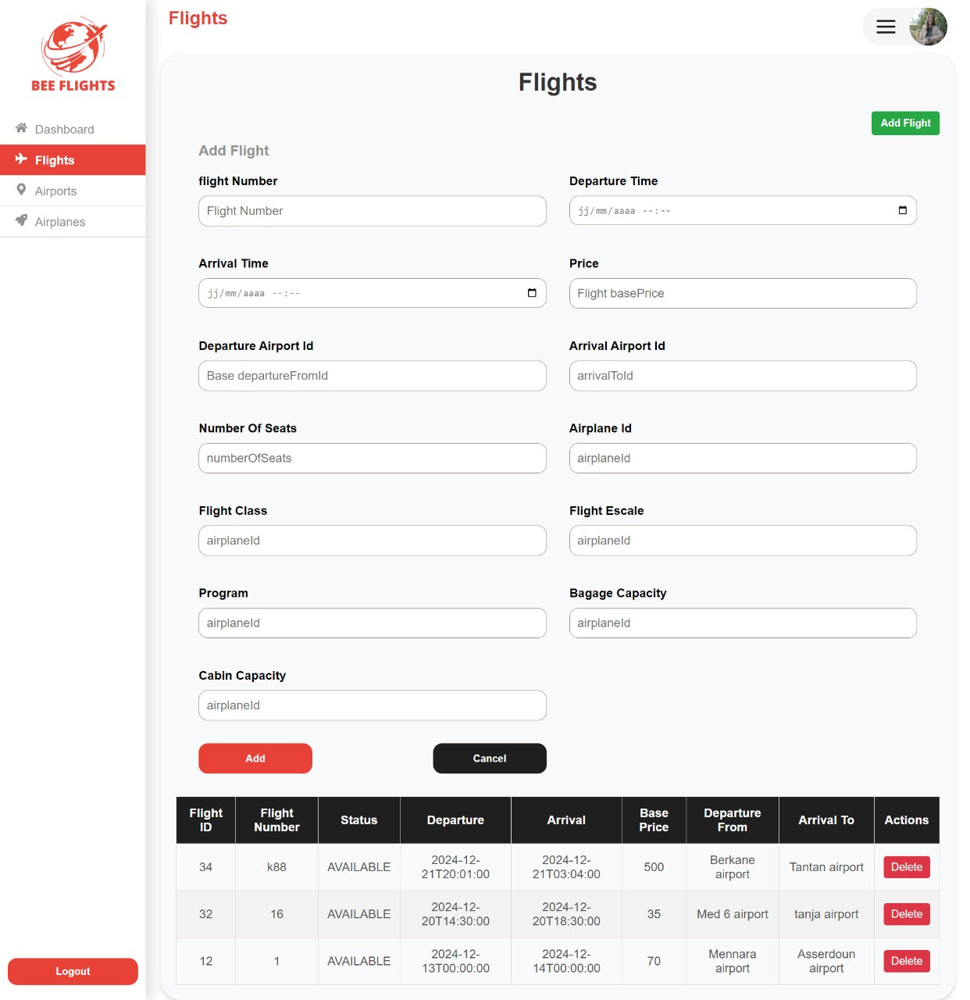
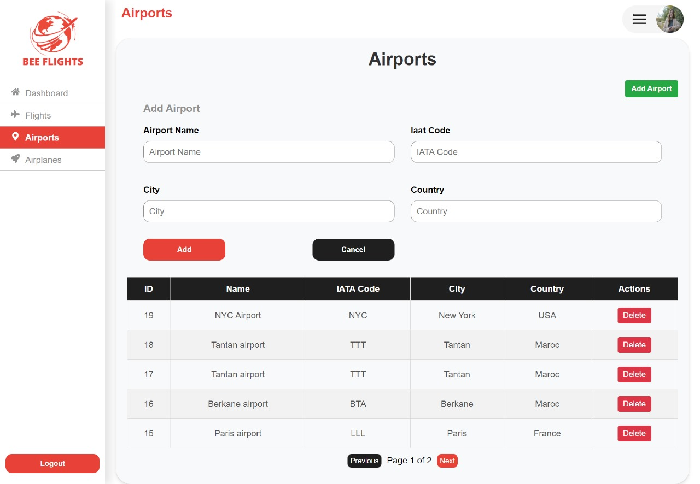
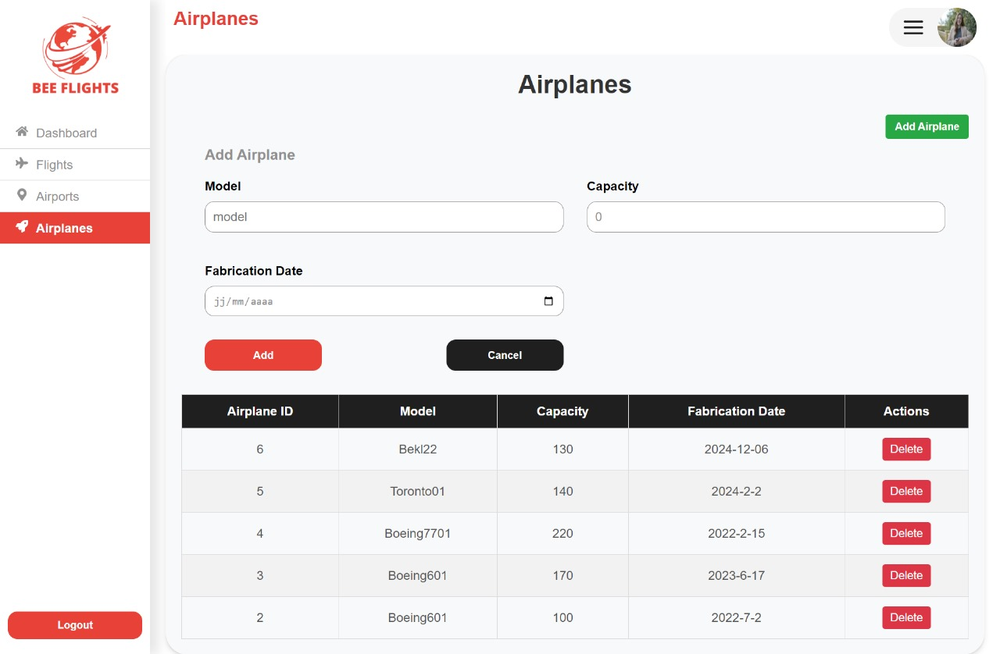

# Bee Flights

A flight management and booking web application. Customers can search and book flights; administrators manage flights, airports and airplanes from a dedicated dashboard.

## Features

**Customer side**

- Registration with e-mail account validation (validation code)
- Login / logout
- Flight search: one-way trip, cabin class, departure, arrival, date
- Filters: transit amount (non-transit, 1 stop, 2+ stops), price range, flight class
- Flight details: schedule, duration, free baggage and cabin allowance, price per person (MAD)
- Booking form: passenger identity, contact details, passport, number of seats

**Admin side**

- Dashboard with statistics: flights booked per month, monthly revenue (MAD), flight status distribution (on-time / delayed / cancelled)
- Flights management: add, list, delete (number, times, base price, departure/arrival airports, seats, airplane, class, escale, baggage and cabin capacity)
- Airports management: add, list, delete, with pagination
- Airplanes management: add, list, delete (model, capacity, fabrication date)

## Screenshots

### Authentication

| Register                              | Account validation                                                    | Login                           |
| ------------------------------------- | --------------------------------------------------------------------- | ------------------------------- |
|  |  |  |

### Search & booking





### Admin dashboard









## Tech stack

- **Frontend:** React 18 + Vite + TypeScript
- **Backend:** Not included in this repository (frontend expects an API)
- **Charts:** Chart.js (via `react-chartjs-2`)
- **Auth (frontend):** JWT stored in `localStorage` (`authToken`), decoded with `jwt-decode`

Major libraries (from `package.json`): `react`, `react-dom`, `vite`, `typescript`, `axios`, `bootstrap`, `sass`, `chart.js`, `react-chartjs-2`, `react-router-dom`, `jwt-decode`, `react-icons`.

## Getting started

### Prerequisites

- Node.js
- `vite` ^5.4.10
- `typescript` ~5.6.2
- `@vitejs/plugin-react` ^4.3.3

### Installation

```bash
git clone https://github.com/Kaoutar-n/flight-management-front.git
cd flight-management-front
npm install
npm run dev
```

- The frontend is a Vite app;
  the default dev server port is `5173` unless overridden in your environment or Vite config.
- The frontend expects a backend API at `http://localhost:8088/api/v1` by default (see [src/api/apiClient.ts](src/api/apiClient.ts#L1-L20)).

If you have a separate backend, start it on port `8088` or update the API base URL in `src/api/apiClient.ts`.

## Project structure

Top-level files:

- `package.json` — frontend dependencies & scripts
- `vite.config.ts`, `tsconfig.json` — build/dev configuration

`src/` (main frontend source):

- `admin/` — admin pages and dashboard components (`AdminFlights.tsx`, `AdminAirport.tsx`, `AdminAirplanes.tsx`, etc.)
- `api/` — API client (`apiClient.ts`) that points to `http://localhost:8088/api/v1`
- `assets/` — static images and icons used by the UI
- `components/` — reusable UI components (Footer, NavBar, Search, etc.)
- `login/` — authentication UI (`Login.tsx`, `Register.tsx`, `ValidateAccount.tsx`)
- `mainHome/` — main customer-facing pages (booking, booking form, profile, topbar)
- `results/` — screenshots used in the README (`*.jpg`, `*.png`)
- `styles/` — CSS / SCSS files
- top-level React entry points: `App.tsx`, `main.tsx`, `Presentation.tsx`

Files of interest:

- [src/api/apiClient.ts](src/api/apiClient.ts#L1-L20) — API base URL is hard-coded here.
- [src/login/Login.tsx](src/login/Login.tsx#L1-L120) — login flow, stores JWT in `localStorage`.
- [package.json](package.json#L1-L200) — dependency versions and npm scripts.

## Roadmap

- [ ] Round-trip and multi-city search
- [ ] Booking history for customers
- [ ] Online payment
- [ ] Edit (not only add/delete) for flights, airports and airplanes
- [ ] Real data for dashboard statistics

## Author

**Kaoutar** — [GitHub](https://github.com/Kaoutar-n)

---
